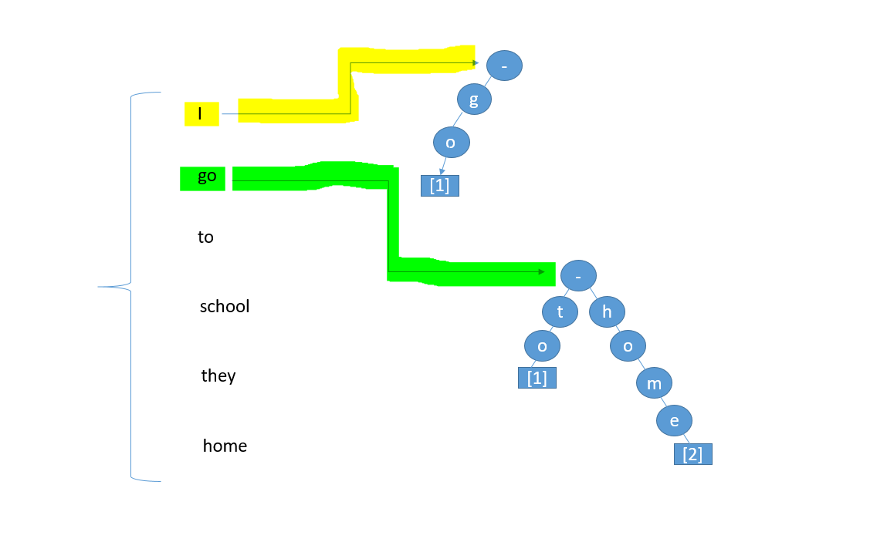

# Google project - Auto complete sentences

## goal
The task was as follows:

We got a particularly huge database. The task was to complete user sentences from the database. To do this one had to think about how to build the data structures in order for the task (completing sentences for the client) to be performed in the best way.

## What does the data structure look like??
We used 2 data structures that each have their own advantages and disadvantages but the use of both tries to reduce the disadvantages as much as possible and take the advantages as much as possible. There is a large dictionary  whose `keys` are all the words in the database.
    
*Why make every word a `key` and not every sentence a `key`?*

*- A dictionary with too many values can lose from the rapid complexity of its retrieval and entry. And it will be impossible to look for a part of a sentence*

So what is the `value`, for a `key` - word?

The initial thought is that the `value` will be all the **following** words in the sentence after that word, in all the sentences. This will help us look for part of a sentence.

To arrange such a large amount of words in an efficient data structure we will use **trie**.

In the leaf of the end of each word we will keep the source of the sentence where it is the next word after the word that is the `key`.

Below is a picture of an explanation of what the data structure will look like when the sentences we received are:

```
[1] I go to school
[2] they go home
```
The DB will look like:



When the array of sources in the leaf of each word is represented by the path of the file and the location in the file.

### Now, After we have finished building the data structure, how is the search performed?

When the user types a word / beginning of the search phrase to complete, it will be done as follows:

We will take from the big `dictionary` the `value` with the `key` being the first word in the search bar.

This `value` is a trie. Go down the tree by the **second** word in the search bar and find **all the places where the phrase of the first word with the second is found.**

next step- We will take from the big `dictionary` the `value` with the `key` being the second word in the search bar.... Just like before. What is different is that we are now working with the second and third word - we will get all the sources where the combination of the second word with the third.

And so on just about every word in the search bar.

Now we will take the cut of all the sources, **we will get the sources where the whole search bar appears!**

### Extensions:
Even a signal error will bring me results. (I go through all the possible mistakes and perform the search for them).

By calculating the `score` for each mistake only the 5 best results are displayed.